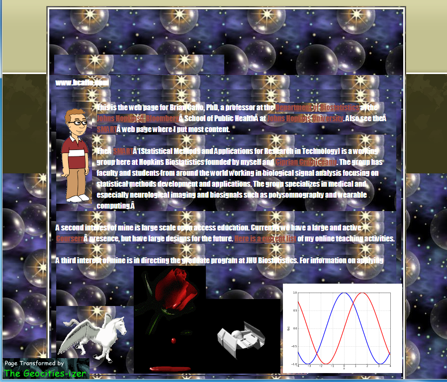
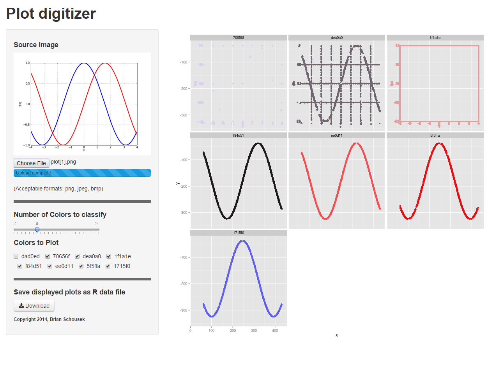

## The Problem

* You have been assigned to confirm the results of a study performed in 1998.

* Unfortunately the magnetic tapes which contained all of the data from the study were used to prop up a poorly shielded CRT monitor. Those tapes are now all blank.

* The only remaining artifacts of the study are some grainy bitmap plots posted to now defunct geocities.com, and are only available at archive.org.


<a href="http://bcaffo.com/" target="_blank"></a>

---


### The Solution: Plot Digitizer



[Plot Digitizer](http://bruno.shinyapps.io/digitize) extracts trace data from bitmap plots and allows the user to save it in an R dataframe.


---

### Methods


* [Plot Digitizer](http://bruno.shinyapps.io/digitize) loads the image into R and performs hierarchical cluster analysis.
* Plots can be jpeg, bitmap, or png. (Sorry, 16 color animated pegasus gifs not supported.)
* The user can choose how many color levels are to remain in the resulting data.
* The user can also choose which of the extracted colors are plotted and saved to the R data file.
* Liberal use of reactive() shiny functions keeps the response snappy.
``` {r echo=FALSE }
library(knitr)
set.seed(234)
sampledata=data.frame(x=rnorm(10),y=rnorm(10))

```
``` {r plot,fig.width=4, fig.height=3}
clusters=hclust(dist(sampledata))
plot(clusters,ann=FALSE)
```

---


# Study: Reproduced!

Check out the application at [shiny.rstudio.com](http://bruno.shinyapps.io/digitize)
<br>Check out the application source at <a href="https://github.com/bschousek/digitize">github</a>
<br><br>
This presentation was produced using [slidify](http://slidify.org/)<br>and the [reveal.js](http://lab.hakim.se/reveal-js/#/)framework
<br>Presentation source at [github](https://github.com/bschousek/digitize_present)
<br>

